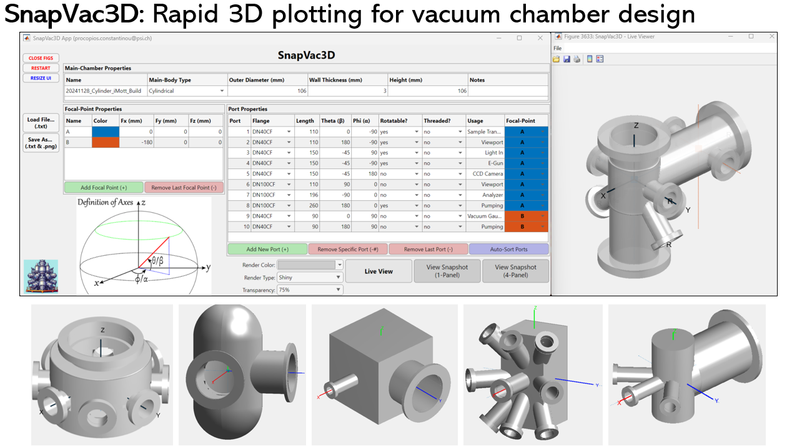

# SnapVac3D: Rapid 3D plotting for vacuum chamber design

[SnapVac3D](https://github.com/c0deta1ker/SnapVac3D) is a new, free, standalone app that enables users to effortlessly design custom vacuum chambers in 3D with exceptional precision and speed. Seamlessly browse through your designs to ensure feasibility, then save them as text files and PNGs for easy retrieval or sharing with your preferred vacuum supplier / collaborators. Crafting your perfect vacuum chamber has never been more accessible!

This app is tailored for researchers, engineers, technicians, and students interested in designing bespoke vacuum chambers, without the need of using CAD software. Whether you are collaborating on a vacuum chamber design, working on a research project, or simply curious about creating your own design, this app facilitates easy iteration. You can continuously monitor the progress of your model as you build it port-by-port, with the option to save the results at any time. Additionally, you can save the final tables as a single .txt file, which can be easily reloaded, making it super simple to collaborate or share your designs with others. The final saved text file also contains all the technical information your vacuum supplier needs. [Download SnapVac3D](https://github.com/c0deta1ker/SnapVac3D/releases/download/v1.0/SnapVac3D_Installer_Web.exe) today and bring your designs to life in a snap!  

## Installation  
To run within a MATLAB environment:  
1. Download the *SnapVac3D* repository.
2. Open MATLAB and use *Set Path* in the *Home* tab to add the *SnapVac3D* repository and all its sub-folders into its saved search paths.
3. Type 'App_SnapVac3D' in the MATLAB Command Prompt to boot up the  App.

Or, simply download & install the standalone app via the executable file [here](https://github.com/c0deta1ker/SnapVac3D/releases/download/v1.0/SnapVac3D_Installer_Web.exe)!       

Currently available on the Windows operating system only.      
  
## App Details
   

The vacuum design is split into three independent tables of properties:  

**(1) Main-Chamber Properties**: Define the morphology of your main chamber (choice of cylindrical, spherical, tetragonal or capsule) along with its dimensions & wall thickness. Here, you can also give your design a name and add some notes.  

**(2) Focal-Point Properties**: Specify the focal points, which serve as the origin points for each port placement.  

**(3) Port Properties**: Configure all necessary ports using conventional European (DN) sizes, based on tube inner diameters in millimetres. Define the length and rotational orientation (via spherical coordinates) of each port. Additionally, specify whether the port is rotatable or threaded and label its usage. Crucially, the focal point to serve as the origin for each port can also be defined with a drop-down box.     

You can execute and view the current model at any time. The application offers several options for 3D rendering, as well as a transparency setting that allows you to adjust the plot's transparency for an inside view of your design. Any intersections of the ports and main body are also removed, whilst maintaining optimal performance.    

## MATLAB Version control  
MATLAB version:   2024a  
MATLAB add-ons (recommended): None required

## Authors
**Dr. Procopios Constantinou**,  
Swiss Light Source (SLS),  
Paul Scherrer Institute (PSI),  
email: procopios.constantinou@psi.ch

## Acknowledgments
I would like to thank Dr. Vladimir Strocov (PSI) and Leonard Nue (PSI) for their invaluable guidance and feedback in the design and execution of this software application.

## License  
This project is licensed under the GNU General Public License v3.0 - see the [LICENSE.md](LICENSE.md) file for details. 

--PCC, April 2025

