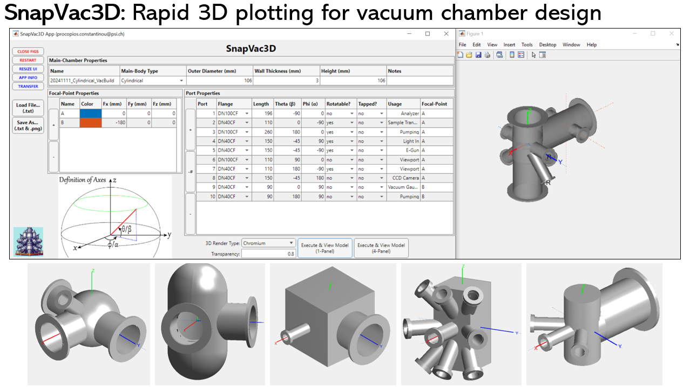

# SnapVac3D: A fast 3D software to get a snapshot of designing vacuum chambers

[SnapVac3D](https://github.com/c0deta1ker/SnapVac3D) is a MATLAB-integrated application that allows you to effortlessly design custom vacuum chambers with precision and speed in three-dimensions.   

## Installation   
1. Download the *SnapVac3D* repository.
2. Open MATLAB and use *Set Path* in the *Home* tab to add the *SnapVac3D* repository and all its sub-folders into its saved search paths.
3. Make sure you also use *Set Path* to add the repository / folder that contains all of your data to be loaded in.
4. Type 'App_SnapVac3D' in the MATLAB Command Prompt to boot up the App.

## SnapVac3D App
The main MATLAB App that provides seamless navigation to all other MATLAB apps using the comprehensive Materials Properties Database. Accessible in MATLAB via 'App_MatBase'.
  
